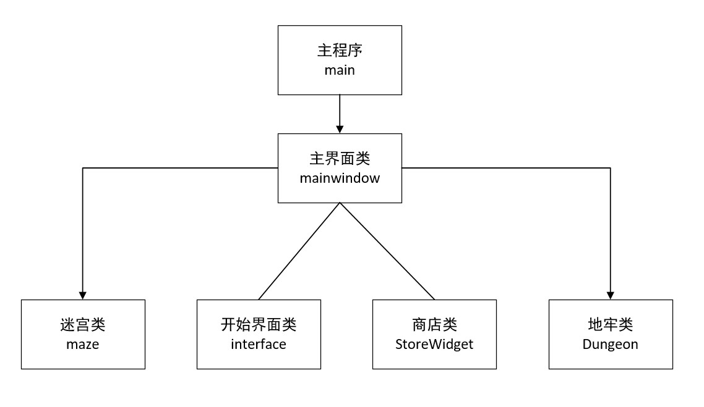

# 整体结构

- 游戏中有迷宫模式和地牢模式两种游戏模式，主要由5个类组成

- 主界面类包含其它4个类

- 迷宫类maze主要实现迷宫模式中，迷宫地图的随机生成，寻路算法存储的路径

- 地牢类Dungeon主要实现地牢地图的生成，初始化地图贴图资源字符串，地牢中角色信息的初始化，战斗伤害的计算

- 开始界面类interface主要实现开始界面的设置

- 商店类StoreWidget主要实现地牢模式中的商店功能

  
