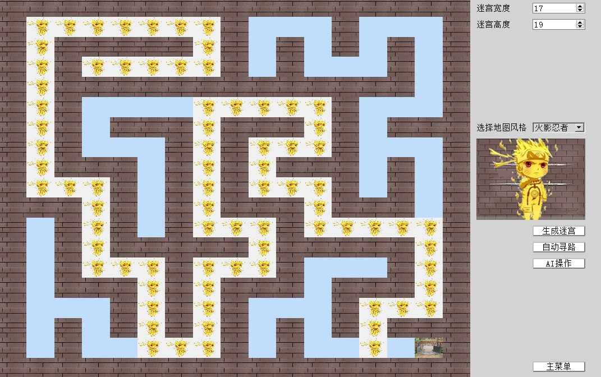
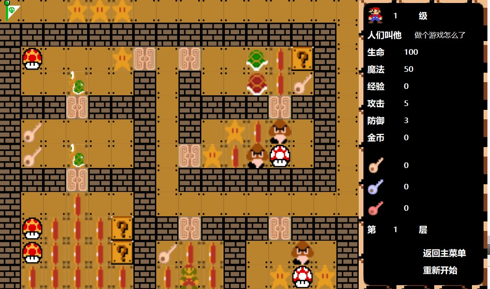
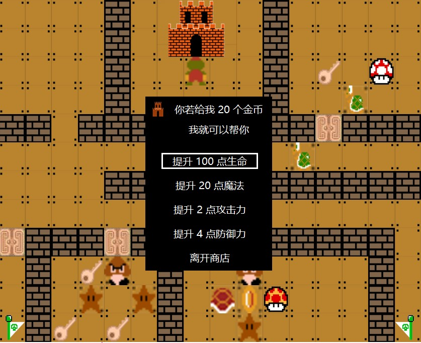
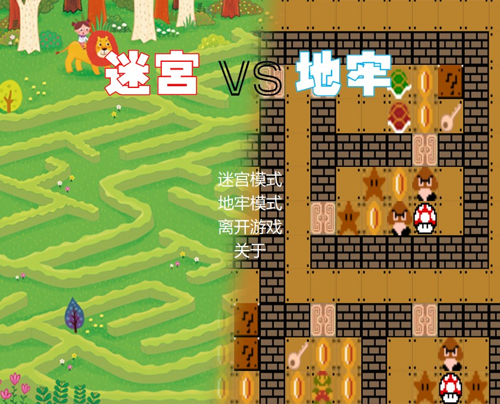
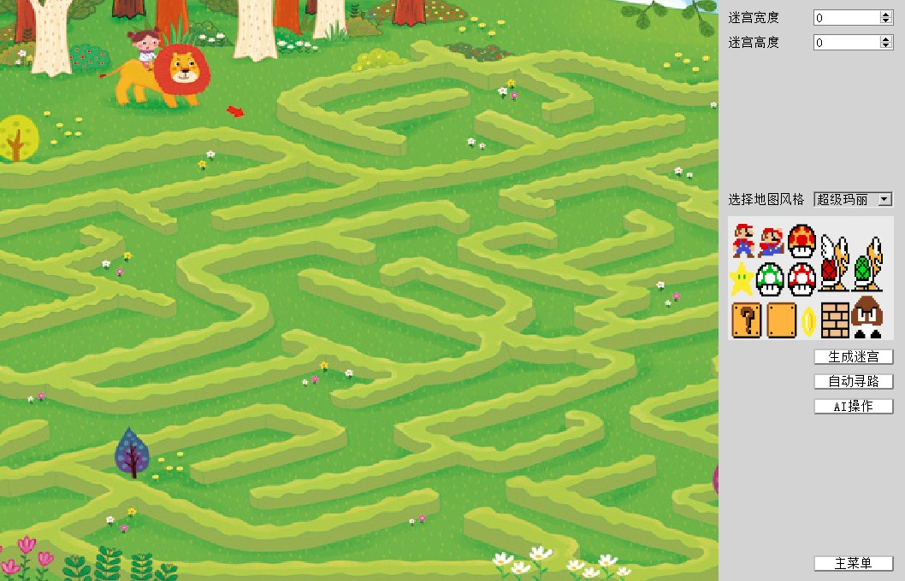
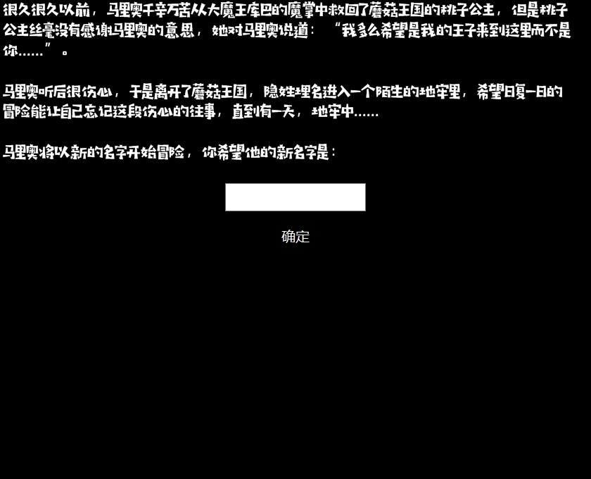
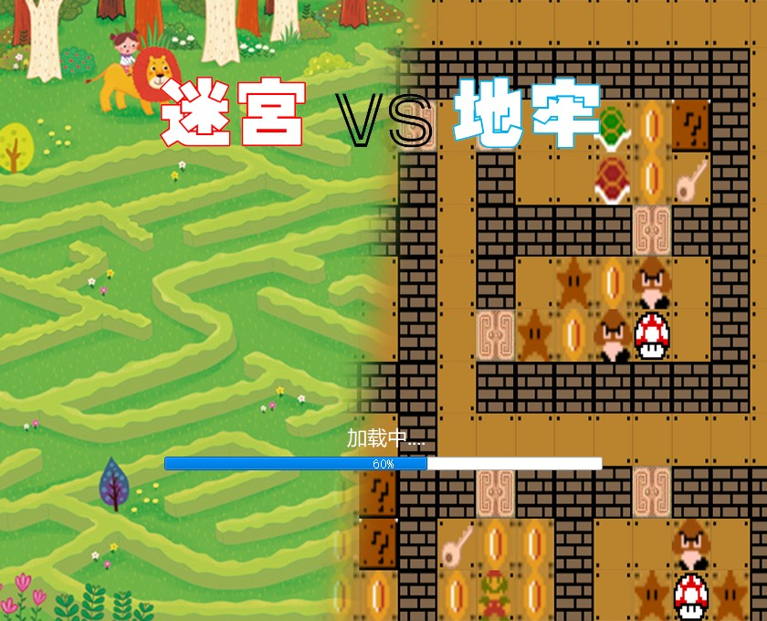
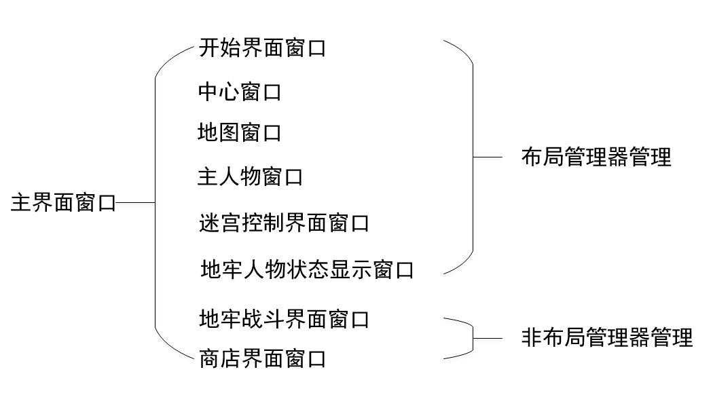
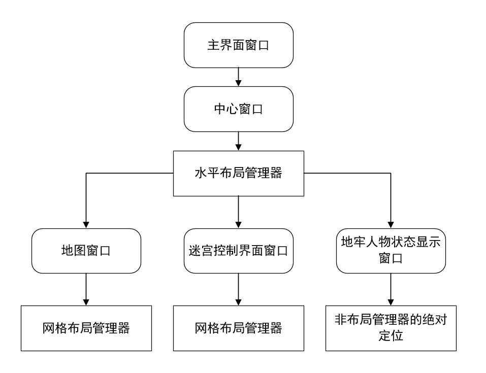

# 核心实现

#### 迷宫类中的自动寻路算法autoFindPath的实现

- 在生成迷宫时，将可以走的路标记为1，不能走的墙标记为0。自动寻路时，从当前位置开始每次都从4个方向，按照左、下、右、上的顺序来检测前方是路还是墙（标记是1还是0），一旦找到一个方向上的路是可以走的，则将此方向上的路的坐标存储到路径栈PathStack中，并且标记已经走过的路，防止走回头路陷入死循环。如果探测后4个方向都找不到可以走的路，则将路径栈中栈顶元素出栈，回退到上一个路径点重新探测，跳过被标记为走过的路，如果4个方向依然找不到可以走的路，则重复上述步骤，将当前路径栈栈顶元素出栈，回退到上一个路径点重新探测，一直重复上述步骤，直到探测到可以走的路才将此方向上的路压入到路径栈中，并继续向前探测。生成的迷宫地图必有一条通路，所以总能找到一条通往出口的路径。

  

#### 地牢类中初始化地牢地图initialMap的实现

- 地牢中每层的地图都不相同，而且每层地图中还有许多游戏角色（物品、怪物、金币等）。而且每层地牢之间是连通的，可以去往下一层地牢，也可以回到上一层地牢，而玩家在地牢中对每层地牢造成的影响都必须保存着，为了实现地牢的这些效果，将地牢抽象为一个3维数组。数组的第3维代表地牢的层数，第1维和第2维表示每层的地牢地图。每层地牢就可以通过第3个维度进行联系，而且每层的地图可以设置为不相同，并且玩家对地牢造成的影响都可以储存在这个3维数组当中。

- 在实现地牢中每层地图的过程当中，为了方便加载地图资源，将二维数组中的元素与地图贴图资源的名称相对应，比如0代表墙，1代表路，2代表金币，3代表小星星，15代表下一层入口，20代表黄钥匙等等。

- 地牢中的英雄与怪物都有自身的属性，如生命值、攻击力、防御力等等，将他们都抽象为一个结构体，结构体中存储英雄与怪物的自身属性，修改起来也较为方便

  

#### 商店类中商店购买功能的实现

- 商店是通过键盘操作上移下移选项框来进行选择，再通过Enter或者Space键进行购买。在实现时重写QT键盘事件keyPressEvent来实现商店的购买功能。当检测到输入按键为W，选项框就会上移，但若选项框已停留在第一个选项上则不会上移，检测到输入按键为S时，选项框就会下移，但若选项框已停留在最后一个选项上则不会下移。当检测到输入按键为Enter或者Space时，会做出判断，如果选择的选项不是离开商店，则继续进行判断，否则关闭商店窗口。当选择的不是离开商店时，会先判断当前剩余金币是否大于等于当前购买的花费，如过小于，则不能购买，对按键操作不反应，并提示玩家，金币不足。若满足购买的花费，则执行购买操作，每次购买完成后，都会更新商店选项与购买花费，为了平衡游戏难度，“提升攻击力”与“提升防御力”选项不会更新。

  

#### 开始界面类的实现

- 开始界面提供游戏模式选择接口，玩家通过点击不同模式的选项框进入到不同的游戏模式。开始界面的背景窗口是重写绘图事件paintEvent来实现的，每当开始界面窗口更新时，都会触发绘图事件，绘制窗口背景图片。当玩家点击进入不同的游戏模式时，也会触发绘图事件，绘制不同游戏模式的窗口背景图片。

- 当玩家选择迷宫模式或者地牢模式按钮后，会出现加载进度条。加载进度条是由QT中的QprogressBar进度条类来实现的。通过Qtimer计时器类对象发出的timeout信号，来触发槽函数loading实现进度条值的变化，当进度条跑满时，使用窗口的update函数强制刷新窗口来执行绘图事件，这样就将玩家的点击与进度条的变化，窗口背景的绘制都联系起来了。

- 

  

  

  

#### 主界面的实现

- 主界面中的窗口结构与使用的布局管理器结构图以在上图给出。当主窗口构造分配内存时，这些窗口也会被分配内存。在实际的游戏执行过程中，会将除主窗口外的所有其它窗口先隐藏起来，即调用窗口的hide函数，当游戏打开时，最先显示的是开始界面窗口，玩家点击不同的接口按钮后，根据玩家选择的模式按钮，显示对应模式下的窗口，同时隐藏开始界面窗口

- 玩家选择迷宫模式后，在进度条跑满后，会触发绘图事件，开始界面的背景图片重新绘制为迷宫模式的窗口图片，当玩家输入好迷宫大小点击生成迷宫按钮后，开始界面窗口会隐藏起来，同时地图窗口与迷宫控制界面窗口和主人物窗口会显示，这样就是实现了玩家控制窗口切换的效果

- 同样的，玩家选择地牢模式后，在进度条跑满后，会触发绘图事件，开始界面的背景图片重新绘制为地牢模式的窗口图片，当玩家输入角色名后，开始界面的窗口会隐藏，同时地图窗口与地牢人物状态显示窗口和主人物窗口会显示出来。当玩家在地牢中碰到怪物后，地牢战斗窗口也会显示出来，战斗完成后隐藏起来。当玩家进入商店，商店界面窗口也会显示出来，玩家购买完成，点击离开商店选项后，商店界面就会隐藏起来，这样就实现了玩家与游戏之间的交互

- 每种游戏模式下都有返回主界面按钮，因为在游戏设计时隐藏了主界面窗口的边框，只有通过开始界面的“离开游戏”选项才能退出游戏，在玩家点击退出游戏后，会有提示对话框，玩家必须点击“确认”按钮才会真的突出游戏，这种设计是为了防止玩家误点而关闭游戏

  

  
