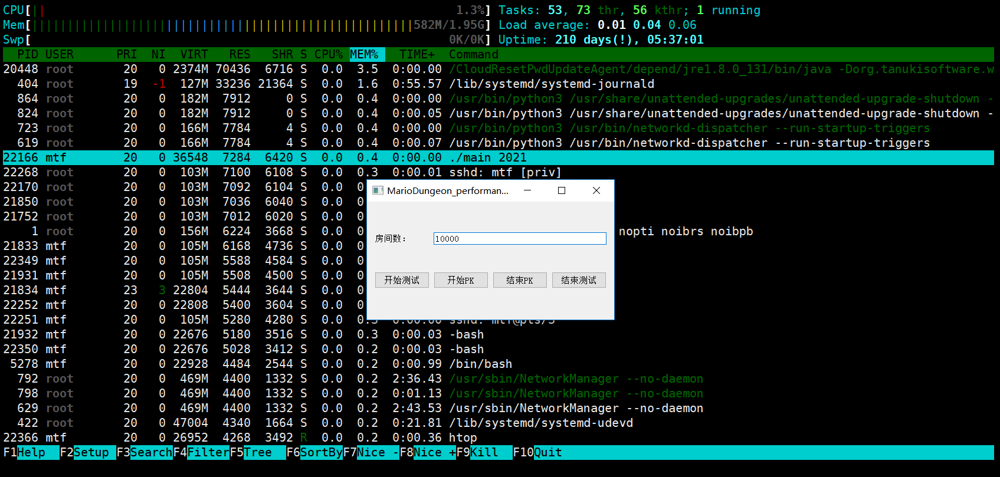
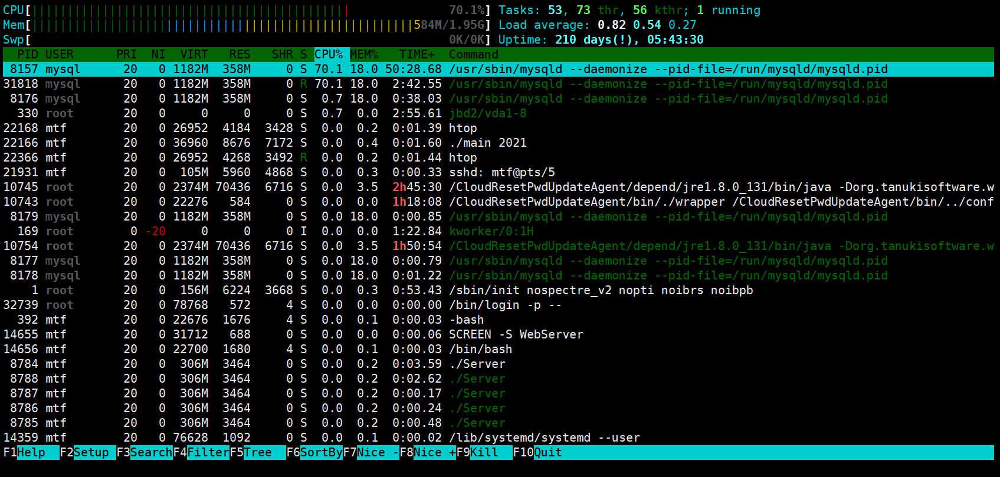
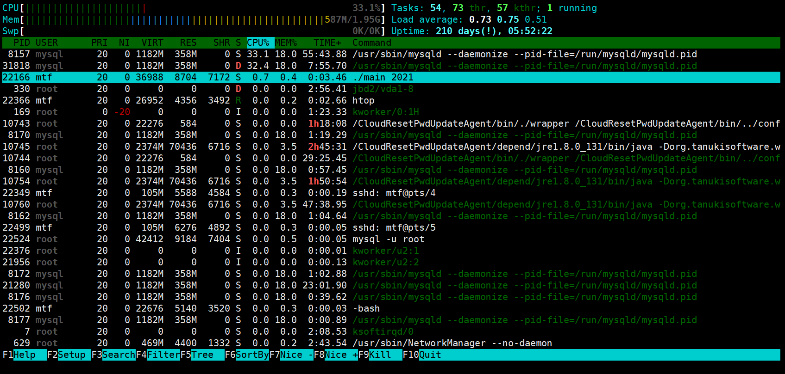
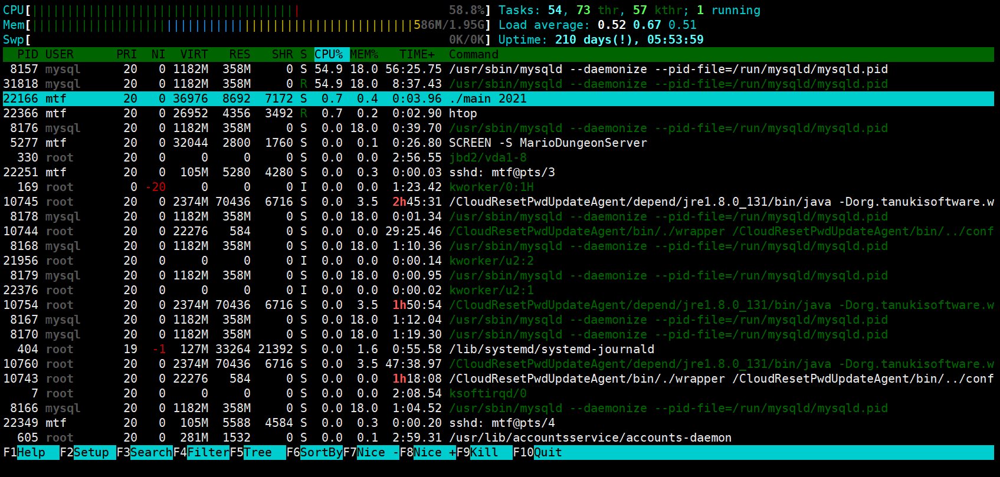
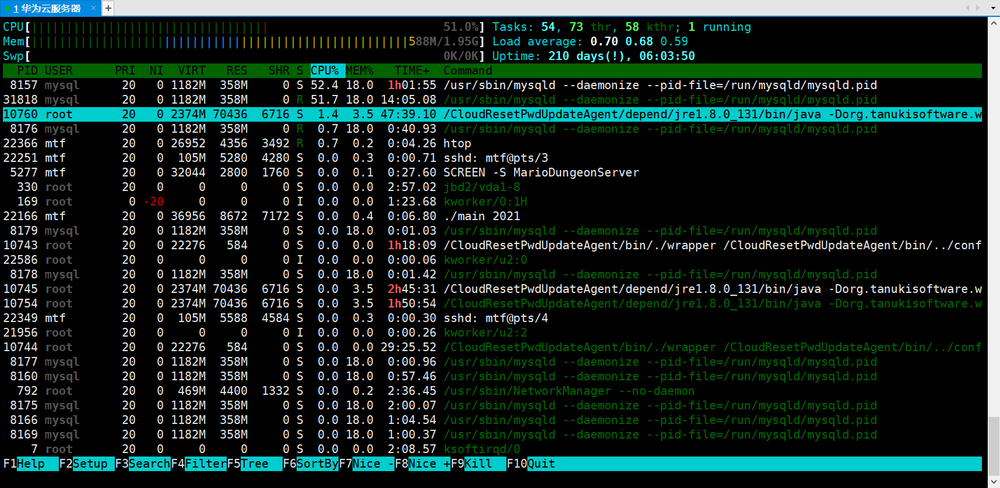
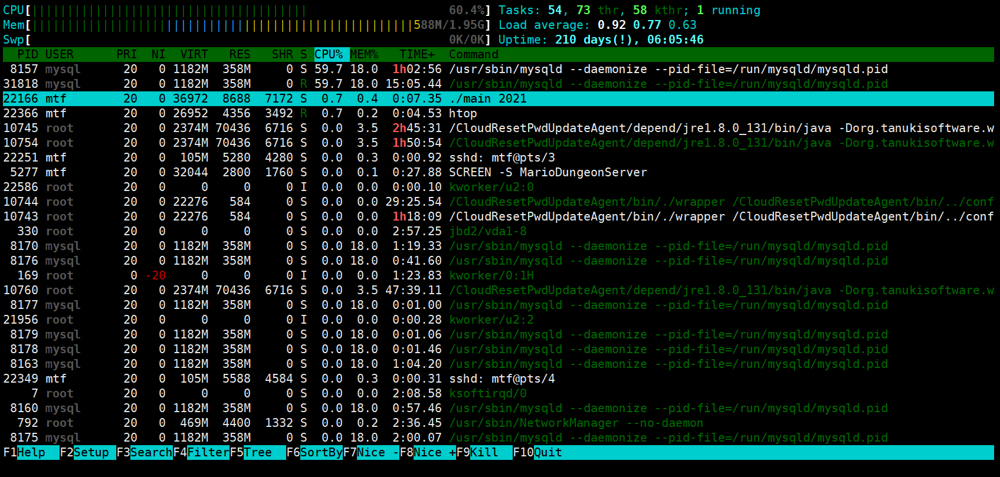
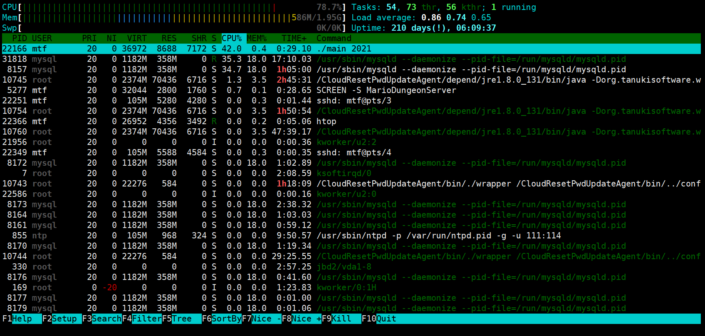
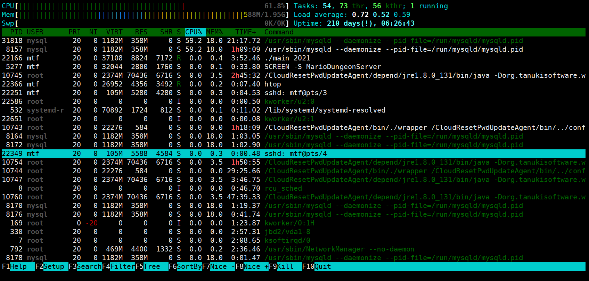

# 测试及优化

### 测试环境

- OS：Ubuntu 18.04
- 内存：2GB
- CPU：Intel(R) Xeon(R) Gold 6161 CPU @ 2.20GHz 单核

### 测试工具

- 基于QTcpSocket开发的测试工具：模拟客户端与服务器建立连接的过程，发送请求指令给服务器进行测试
- 后台CPU及Memory占用情况查看工具：htop

### 测试流程

- 用户注册->用户登录->创建房间->进入房间->玩家准备->游戏开始->服务器下发地图信息->PK更新玩家位置

### 测试参数

- 房间数1W，用户数2W

### 测试结果

- 测试开始前，服务器启动后，服务器 CPU占用0%,内存占用0.4%

  

- 注册登录时，数据处理压力在Mysql，Mysql CPU占用70.1%，内存占用18%

  

- 创建房间时，Mysql数据处理压力下降，Mysql CPU占用33%，内存占用18%

  

- 进入房间后，Mysql数据处理压力上升，Mysql CPU占用54%，内存占用18%

  

- 玩家准备时，Mysql数据处理压力基本不变，Mysql CPU占用52%，内存占用18%

  

- 游戏开始，Mysql数据处理压力上升，Mysql CPU占用59%，内存占用18%

  

- 服务器下发地图信息，数据处理压力在服务器，服务器 CPU占用42%，内存占用0.4，Mysql压力下降

  

- 开始PK，更新玩家位置，Mysql数据处理压力上升，Mysql CPU占用59%，内存占用18%

  
